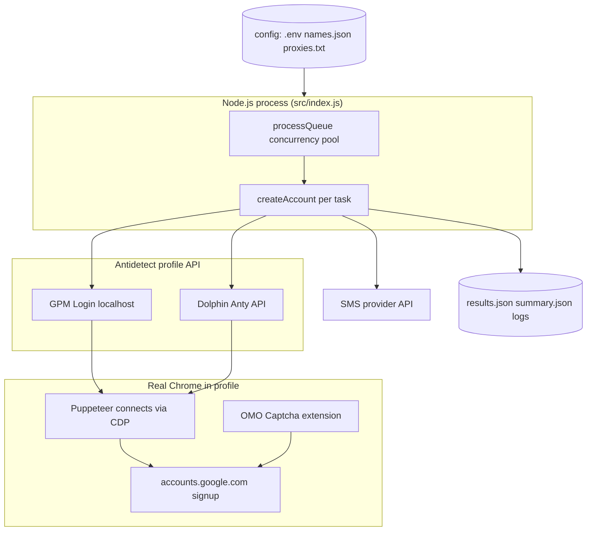
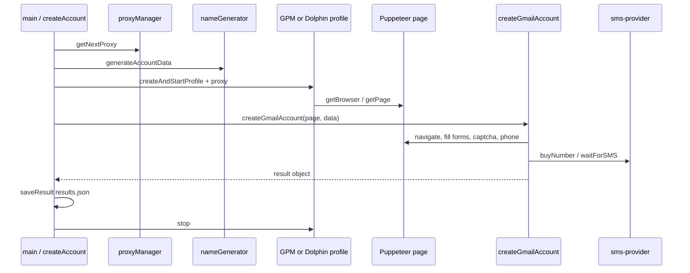
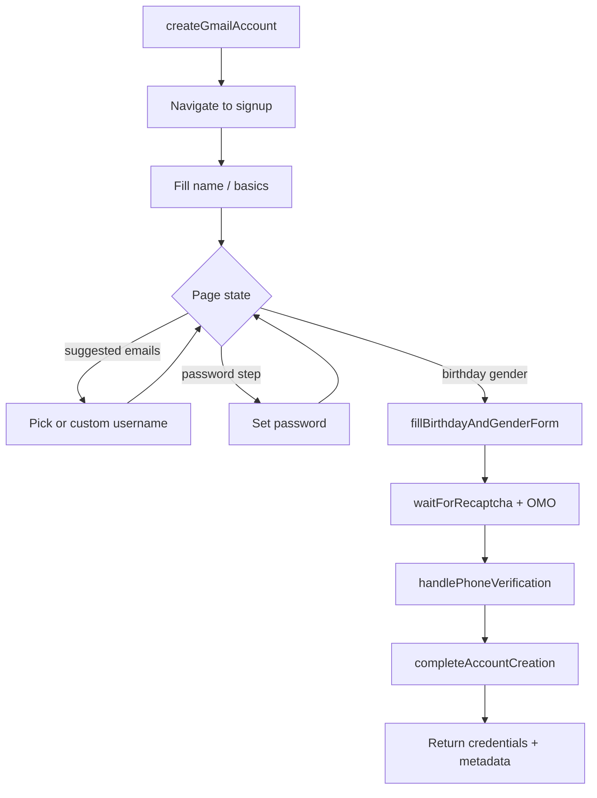

# Gmail Account Creator

[](https://nodejs.org/)
[](https://nodejs.org/api/esm.html)
[](LICENSE)
[](https://pptr.dev/)
[](https://github.com/code-root/gmail-account-creator)

## About

**Gmail Account Creator** is a Node.js automation toolkit that runs **Google / Gmail signup** inside a real **antidetect browser profile** ([GPM Login](https://gpmlogin.com/) or [Dolphin Anty](https://dolphin-anty.com/)), connects with **Puppeteer**, solves **reCAPTCHA** via the **OMO Captcha** extension, and completes **phone verification** through pluggable **SMS** APIs (SMS Verification, 5SIM Legacy). It supports **proxies**, **human-like input**, and **parallel account jobs** with summarized output to JSON and logs.

| | |
|--|--|
| **Repository** | [github.com/code-root/gmail-account-creator](https://github.com/code-root/gmail-account-creator) |
| **Package** | `@code-root/gmail-account-creator` ([GitHub Packages](https://github.com/code-root/gmail-account-creator/pkgs/npm/gmail-account-creator)) |
| **License** | ISC — see [`LICENSE`](LICENSE) |

**Topics (GitHub tags):**  
`gmail` · `automation` · `puppeteer` · `nodejs` · `gpm-login` · `dolphin-anty` · `antidetect-browser` · `captcha` · `sms-verification` · `recaptcha` · `browser-automation` · `javascript` · `dotenv` · `axios` · `es-modules` · `github-packages`

> **Arabic documentation:** full walkthrough, diagrams, and function tables — [`README_AR.md`](README_AR.md).

---

## Repository metadata (GitHub)

These values are configured on the GitHub **About** sidebar (description, website, topics). They were applied to [`code-root/gmail-account-creator`](https://github.com/code-root/gmail-account-creator) via `gh repo edit`; you can change them anytime under **Settings** or with the CLI.

| Field | Value |
|--------|--------|
| **Description** | Automated Gmail signup using GPM Login or Dolphin Anty, Puppeteer, OMO Captcha, and SMS verification APIs. Node.js (ESM). |
| **Website** | https://github.com/code-root/gmail-account-creator#readme |
| **Topics** | gmail, automation, puppeteer, nodejs, gpm-login, dolphin-anty, antidetect-browser, captcha, sms-verification, dotenv, axios, es-modules, javascript, browser-automation, recaptcha, github-packages |

---

## Features

- **Antidetect profiles** — Create/start/stop browser profiles via GPM Login (default) or Dolphin Anty API.
- **Puppeteer control** — Attaches to the profile’s Chrome over remote debugging (no bundled Chromium in `puppeteer-core`).
- **OMO Captcha** — Extension-based reCAPTCHA handling (extension ID configured in code).
- **SMS providers** — Pluggable SMS layer: default **SMS Verification** API or **5SIM Legacy** (see [`ENV_VARIABLES.md`](ENV_VARIABLES.md)).
- **Proxies** — Rotating proxies from `config/proxies.txt` (`ip:port` or `ip:port:user:pass`).
- **Human-like behavior** — Delays, scrolling, and typing patterns to reduce rigid automation signals.
- **Concurrency** — `--accounts` / `--threads` (or env vars) with a bounded worker pool.
- **Outputs** — Append-only `results.json`, run summary in `summary.json`, logs under `logs/`.

---

## Tech stack

| Layer | Technology |
|--------|------------|
| Runtime | **Node.js** (ESM, `"type": "module"`) |
| Browser automation | **puppeteer-core** (connects to profile browser) |
| HTTP | **axios** |
| Config | **dotenv** (`.env` / optional `.emv`) |
| Profile cloud (optional path) | **gologin** package present in dependencies; primary flow uses **GPM** or **Dolphin** per `PROFILE_SERVICE` |

---

## How it works (high level)

1. **Load config** from `.env` (see [`ENV_VARIABLES.md`](ENV_VARIABLES.md), [`.env.example`](.env.example)).
2. **Pick a proxy** from `config/proxies.txt`.
3. **Generate identity** (names/usernames from `config/names.json` via `src/utils/name-generator.js`).
4. **Create & start** an antidetect profile (GPM or Dolphin) with that proxy.
5. **Connect Puppeteer** to the profile’s debugging endpoint and open the signup flow (`src/gmail/creator.js`).
6. **Solve captchas** via OMO Captcha extension setup (`src/captcha/omo-handler.js`).
7. **Order/receive SMS** through the configured SMS provider (`src/providers/sms-provider.js`).
8. **Persist results** to `results.json` and aggregate stats to `summary.json`; **stop** the profile in `finally`.

Intelligent page handling lives in `src/gmail/page-detector.js`.

---

## Architecture diagrams

GitHub renders [Mermaid](https://mermaid.js.org/) in Markdown. If previews fail locally, view the file on GitHub.

### System context



### One account — sequence (happy path)



### Gmail signup sub-flow (logical)



### Concurrency model

| Concept | Meaning in this project |
|--------|-------------------------|
| **Account task** | One call to `createAccount()` (one profile lifecycle). |
| **Thread label** | Log prefix only; implementation uses async promises, not OS threads. |
| **Concurrency** | `processQueue` keeps at most `threadsCount` tasks in flight. |
| **Shared state** | Each task uses its own profile; `proxyManager` tracks used proxy lines. |

---

## Module map

| Path | Responsibility |
|------|----------------|
| `src/index.js` | CLI args, task queue, `saveResult`, run summary to `summary.json`. |
| `src/config.js` | Loads `.env` / `.emv`, exports `config` object and validation warnings. |
| `src/gmail/creator.js` | Full signup automation; exports `createGmailAccount`. |
| `src/gmail/page-detector.js` | Detects which Google screen is shown; wait helpers. |
| `src/captcha/omo-handler.js` | OMO Captcha extension checks, key entry, `setupOMOCaptchaExtension`. |
| `src/gpmlogin/client.js` | REST calls to GPM API (create/start/stop profile, fingerprint). |
| `src/gpmlogin/profile.js` | `GPMLoginProfile` + `createAndStartProfile` factory. |
| `src/dolphin/client.js` | Dolphin Anty REST (profiles, folders, proxy). |
| `src/dolphin/profile.js` | `DolphinProfile` + `createAndStartProfile` factory. |
| `src/gologin/client.js` | GoLogin cloud API client (large; optional integration path). |
| `src/gologin/profile.js` | `GoLoginProfile` + `createAndStartProfile` factory. |
| `src/providers/sms-provider.js` | Chooses SMS Verification vs 5SIM Legacy; unified exports. |
| `src/providers/sms-verification-api.js` | Raw HTTP helpers for SMS Verification API. |
| `src/providers/fivesim-api-legacy.js` | 5SIM Legacy (`api1.5sim.net`) integration. |
| `src/utils/logger.js` | Leveled logs to console + daily file under `logs/`. |
| `src/utils/proxy-manager.js` | Reads `config/proxies.txt`, rotation / formats. |
| `src/utils/name-generator.js` | Random identity from `config/names.json`. |
| `src/utils/human-behavior.js` | Mouse, scroll, typing delays for automation realism. |

---

## Function reference

Below: **every exported function** and **named public methods on exported singletons/classes** used across the app. Internal helpers inside `creator.js` are listed in a separate subsection (they are not `import`able).

### `src/index.js`

| Symbol | Type | Description |
|--------|------|-------------|
| `saveResult(result)` | function | Appends one object to `results.json` with ISO timestamp. |
| `createAccount(accountNumber)` | async function | Full pipeline: proxy → data → profile → `createGmailAccount` → save → cleanup. |
| `processQueue(queue, concurrency)` | async function | Runs an array of zero-arg async factories with a sliding concurrency limit; returns stats. |
| `main()` | async function | Parses argv/env, builds the queue, awaits `processQueue`, writes `summary.json`. |
| `default` export | object | `{ createAccount, main }` for programmatic use. |

### `src/config.js`

| Symbol | Description |
|--------|-------------|
| `config` | Frozen-style plain object: `profileService`, `gpmlogin`, `dolphin`, `gologin`, `omocaptcha`, `smsVerify`, `app`. |
| `default` | Same as `config`. |

### `src/gmail/creator.js`

| Symbol | Description |
|--------|-------------|
| `createGmailAccount(page, accountData)` | **Main export.** Drives the entire Google registration UI flow on the given Puppeteer `page`. |

**Internal helpers** (used only inside this file; roughly in call order):

| Function | Role |
|----------|------|
| `getCountrySelection()` | Picks SMS country based on `SMS_PROVIDER` and `config.smsVerify.countries`. |
| `humanLikeType(page, input, text, options)` | Types into an input with variable speed and occasional corrections. |
| `ensurePageOpen(page, operation)` | Guards against closed/disconnected pages before actions. |
| `navigateToSignUp(page)` | Opens Gmail / Google signup entry. |
| `fillSignUpForm(page, accountData)` | Name and initial signup fields. |
| `selectRandomSuggestedEmail(page)` | Chooses from Google’s suggested addresses when shown. |
| `clickCreateOwnGmailAddress(page)` | Clicks “create your own” / custom username path. |
| `fillUsernameAndPassword(page, accountData)` | Username + password steps and related prompts. |
| `fillBirthdayAndGenderForm(page, accountData)` | Birthday and gender screens. |
| `waitForRecaptcha(page)` | Waits for / interacts with reCAPTCHA with OMO support. |
| `handlePhoneVerification(page, accountData)` | Orders number, enters phone, reads SMS code via provider. |
| `generateRecoveryEmail()` | Builds a secondary/recovery email string when required. |
| `completeAccountCreation(page, accountData)` | Final confirmations, review screens, wrap-up. |
| `clickNextButton(page)` | Finds and clicks Google’s “Next” / continue buttons with fallbacks. |

### `src/gmail/page-detector.js`

| Symbol | Description |
|--------|-------------|
| `detectGmailPage(page)` | Returns a structured guess of current signup step (and internal detectors). |
| `waitForElement(page, selector, timeout)` | Polls until selector exists or timeout. |
| `elementExists(page, selector)` | Boolean check for a selector. |
| `waitForPageLoad(page, timeout)` | Waits for `load` / network idle style readiness. |
| **Internal** | `detectSignInPage`, `detectSignUpPage`, `detectVerificationPage`, `detectByClassNames`, `detectByElements` — used by `detectGmailPage`. |

### `src/captcha/omo-handler.js`

| Symbol | Description |
|--------|-------------|
| `checkRecaptchaExtension(browser)` | Verifies extension presence in the browser. |
| `openOMOCaptchaExtension(page)` | Opens the extension UI / options page. |
| `setOMOCaptchaKeyViaAPI(page)` | Injects or calls extension APIs to set API key. |
| `enterOMOCaptchaKey(page)` | UI automation to paste/type the OMO key. |
| `clickRecaptchaRefreshButton(page)` | Clicks refresh on the captcha widget when stuck. |
| `setupOMOCaptchaExtension(page)` | Orchestrates full OMO setup before signup needs captcha. |

### `src/gpmlogin/client.js`

| Symbol | Description |
|--------|-------------|
| `generateAndroidUserAgent()` | Builds a plausible Android UA string for profile creation. |
| `generateAndroidFingerprint()` | Generates fingerprint payload for GPM profile. |
| `checkGPMConnection()` | Health check against `GPM_API_URL`. |
| `createProfile(profileName, proxy)` | Creates a remote GPM profile with optional proxy. |
| `startProfile(profileId, options)` | Starts profile, returns debugging address info. |
| `stopProfile(profileId, maxRetries)` | Stops profile with retries. |
| `deleteProfile(profileId, mode)` | Deletes profile by id. |
| `getProfile(profileId)` | Fetches profile metadata. |
| `default` | Object aggregating the above for convenience imports. |

### `src/gpmlogin/profile.js` — class `GPMLoginProfile`

| Method | Description |
|--------|-------------|
| `start()` | Starts GPM profile and resolves CDP / WebSocket endpoint. |
| `getBrowser()` | `puppeteer.connect` to the running browser. |
| `getPage()` | Returns a `Page` (existing or new). |
| `stop()` | Closes Puppeteer connection and stops GPM profile. |
| `delete()` | Removes profile via API. |
| `injectAntiDetectionScripts(page)` | In-page scripts to reduce automation signals. |
| `createAndStartProfile(name, proxy)` | **Exported factory:** create → start → return instance. |

### `src/dolphin/client.js` (exported functions)

| Function | Description |
|----------|-------------|
| `checkDolphinConnection()` | Validates API key and reachability. |
| `createProfile(profileName, proxy)` | Creates Dolphin browser profile. |
| `startProfile(profileId)` | Launches profile. |
| `stopProfile(profileId)` | Stops profile. |
| `deleteProfile(profileId)` | Deletes profile. |
| `getProfile(profileId)` | Metadata fetch. |
| `updateProfileProxy(profileIds, proxy)` | Applies proxy settings. |
| `getFolderList` / `getAllFolders` / `findFolderByName` / `createFolder` / `getFirstAvailableFolder` / `getOrCreateFolder` | Folder management for organizing profiles. |
| `default` | Bundle of the above. |

### `src/dolphin/profile.js` — class `DolphinProfile`

| Method | Description |
|--------|-------------|
| `start` / `getBrowser` / `getPage` / `stop` / `delete` | Same role as GPM profile class. |
| `createAndStartProfile(name, proxy)` | **Exported factory** for Dolphin. |

### `src/gologin/profile.js` — class `GoLoginProfile`

| Method | Description |
|--------|-------------|
| `start` / `getBrowser` / `getPage` / `stop` / `delete` | GoLogin-specific lifecycle. |
| `createAndStartProfile(name, proxy)` | **Exported factory** when using GoLogin path. |

### `src/gologin/client.js` — class `GoLoginClient` (default export)

Representative methods (the file is large; these are the usual integration points):

| Method | Description |
|--------|-------------|
| `request(method, endpoint, data, retries)` | Low-level authenticated HTTP to GoLogin API. |
| `getProfiles` / `getProfile` / `createProfile` / `updateProfile` / `updateProfileProxy` | Profile CRUD. |
| `startProfile` / `stopProfile` / `deleteProfile` | Lifecycle. |
| `testProxy` / `createProfileWithProxy` | Proxy validation and convenience create. |

### `src/providers/sms-verification-api.js`

| Function | Description |
|----------|-------------|
| `getSmsVerifyBalance` | Account balance. |
| `getSmsVerifyCountries` / `getSmsVerifyPrices` / `getSmsVerifyServices` | Catalog / pricing helpers. |
| `buySmsVerifyNumber` / `buySmsVerifyNumberV2` | Purchase a number for a service. |
| `checkSmsVerifyOrder` | Poll activation status. |
| `setSmsVerifyStatus` | Set status code on an order. |
| `cancelSmsVerifyOrder` / `finishSmsVerifyOrder` / `retrySmsVerifyOrder` | Lifecycle actions. |
| `getSmsVerifyActivations` | List activations. |
| `waitForSmsVerifyCode` | Blocking wait until SMS code arrives. |
| `buyNumberAndGetSMS` | High-level: buy + wait for code. |

### `src/providers/sms-provider.js`

| Symbol | Description |
|--------|-------------|
| `loadProvider` | **Internal:** lazy `import()` of 5SIM or SMS Verification implementation. |
| `getBalance` / `buyNumber` / `buyNumberAndGetSMS` | Unified entry points after provider load. |
| `getOrderStatus` / `waitForSMS` | Status polling and SMS wait. |
| `cancelOrder` / `finishOrder` / `requestResend` / `setOrderStatus` | Order management. |
| `reportNumberUsed` | 5SIM-only hook; may no-op on SMS Verification. |
| `getServiceName` / `getProviderType` | Introspection for logs. |
| `SMS_PROVIDER_INFO` | `{ current: SMS_PROVIDER }`. |
| Aliases | `buySmsVerifyNumber`, `waitForSmsVerifyCode`, `cancelSmsVerifyOrder`, `finishSmsVerifyOrder`, `getSmsVerifyStatus`, `resendSmsVerifyCode` map to unified functions. |
| `SMS_VERIFY_COUNTRIES` | Re-exported constant map for country codes. |
| `default` | Lazy singleton reference (prefer named exports). |

### `src/utils/logger.js`

| Symbol | Description |
|--------|-------------|
| `formatMessage` / `shouldLog` / `writeLog` | **Internal** formatting and level filter. |
| `logger` / `default` | `{ error, warn, info, debug }` — each writes to console and `logs/app-YYYY-MM-DD.log`. |

### `src/utils/proxy-manager.js` — class `ProxyManager` (default instance)

| Method | Description |
|--------|-------------|
| `loadProxies()` | Reads and parses `config/proxies.txt`. |
| `getNextProxy()` | Returns a random unused proxy; resets set if exhausted. |
| `markAsUsed` / `releaseProxy` / `reset` | Track or free proxy lines. |
| `getGPMLoginFormat` / `getGoLoginFormat` / `getStringFormat` | Adapter shapes for profile APIs + logging. |
| `getAvailableCount()` | Approximate free proxy count. |

### `src/utils/name-generator.js` — class `NameGenerator` (default instance)

| Method | Description |
|--------|-------------|
| `loadNames()` | Loads `config/names.json`. |
| `getRandomName(gender)` | Random first name from female/male pools. |
| `generateUsername(firstName, lastName)` | Builds a candidate local-part for Gmail. |
| `generatePassword(length)` | Strong password with charset rules. |
| `generateAccountData()` | One object: first/last name, username, email, password, gender. |

### `src/utils/human-behavior.js`

| Symbol | Description |
|--------|-------------|
| `randomDelay` / `getHumanDelay` | Time ranges per action type. |
| `humanSleep` | Async sleep with variance. |
| `bezierPoint` / `cubicBezierPoint` / `generateMousePath` | **Internal** math for mouse paths. |
| `humanMouseMove` | Moves pointer along a curved path. |
| `getElementCenter` | Bounding box center for clicks. |
| `humanClick` / `humanClickAt` | Click with movement + delay. |
| `humanScroll` / `humanScrollToElement` | Scroll with human-like distance/speed. |
| `explorePageRandomly` | Random micro-interactions on page. |
| `humanType` | Character-by-character typing with mistakes option. |
| `idleMouseMovement` / `simulateReading` / `performRandomAction` | Idle believability. |
| `humanWait` | Waits with optional random actions. |
| `simulateTabSwitch` | Blur/focus window to mimic user context switch. |
| `default` | Object bundling the exported helpers. |

---

## Prerequisites

- **Node.js 18+** recommended.
- **GPM Login** running locally with API reachable at `GPM_API_URL` (default `http://127.0.0.1:14517`), **or** **Dolphin Anty** with `DOLPHIN_API_KEY`, `DOLPHIN_API_URL`, and optional `DOLPHIN_FOLDER_ID`.
- **OMO Captcha** extension installed/configured in the profile template you use (extension ID: `dfjghhjachoacpgpkmbpdlpppeagojhe`).
- **SMS provider** API key(s) as documented in [`ENV_VARIABLES.md`](ENV_VARIABLES.md).
- **Proxies** listed in `config/proxies.txt`.

---

## Installation

```bash
git clone https://github.com/code-root/gmail-account-creator.git
cd gmail-account-creator
npm install
```

Copy environment template and edit:

```bash
cp .env.example .env
```

Add proxies (one per line):

```text
# config/proxies.txt
203.0.113.10:8080
203.0.113.11:8080:user:pass
```

---

## Configuration highlights

| Variable | Role |
|----------|------|
| `PROFILE_SERVICE` | `gpm` (default) or `dolphin` |
| `GPM_API_URL` | GPM Login local API base URL |
| `DOLPHIN_API_KEY`, `DOLPHIN_API_URL`, `DOLPHIN_FOLDER_ID` | Dolphin Anty integration |
| `OMOCAPTCHA_KEY` | OMO Captcha API key |
| `SMS_VERIFY_API_KEY`, `SMS_VERIFY_LANG`, `SMS_VERIFY_COUNTRIES` | SMS Verification provider |
| `SMS_PROVIDER` | `sms-verification` or `fivesim-legacy` |
| `ACCOUNTS_COUNT`, `THREADS_COUNT` | Batch size and concurrency |
| `LOG_LEVEL`, `MAX_RETRIES`, `TEST_PROXY`, `SETUP_OMO_CAPTCHA` | Runtime tuning |

Full reference: [`ENV_VARIABLES.md`](ENV_VARIABLES.md). Additional setup notes: [`SETUP.md`](SETUP.md) (replace any sample keys with your own — never commit real secrets).

---

## Usage

```bash
# Single account, single thread (default)
npm start

# Multiple accounts / threads
npm start -- --accounts=10 --threads=3
npm start -- -a=10 -t=3

# Or via environment
ACCOUNTS_COUNT=10 THREADS_COUNT=3 npm start
```

Dev (Node watch mode):

```bash
npm run dev
```

List Dolphin folders (when using Dolphin):

```bash
npm run list-folders
```

More examples: [`USAGE.md`](USAGE.md).

---

## Project layout

```text
├── bin/
│   └── gmail-account-creator.js   # npm global / npx entry → app.main()
├── src/
│   ├── index.js           # CLI entry, queue, summary
│   ├── config.js          # Env → config object
│   ├── providers/         # SMS: unified provider + API clients
│   │   ├── sms-provider.js
│   │   ├── sms-verification-api.js
│   │   └── fivesim-api-legacy.js
│   ├── gpmlogin/          # GPM profile lifecycle + client
│   ├── dolphin/           # Dolphin Anty integration
│   ├── gologin/           # GoLogin client/profile (optional path)
│   ├── gmail/             # Signup flow, page detection
│   ├── captcha/           # OMO Captcha handler
│   └── utils/             # Logger, proxy, names, human behavior
├── scripts/               # Standalone CLI helpers
│   ├── list-dolphin-folders.js
│   └── omocaptcha-extension.js
├── docs/                  # Extra assets (e.g. OpenAPI export)
├── assets/                # Support QR images (see assets/README.md)
├── config/
│   ├── proxies.txt
│   └── names.json
├── logs/                  # Created at runtime
├── results.json           # Per-attempt records
├── summary.json           # Last run aggregate
└── .github/workflows/     # CI (see below)
```

---

## Releases & GitHub Packages

This repository is published as **`@code-root/gmail-account-creator`** on [GitHub Packages](https://github.com/features/packages) (npm registry).

### Create a GitHub Release (with `.tgz` attachment)

1. Bump `version` in `package.json` (and commit).
2. Create and push an annotated tag: `git tag v1.0.1 && git push origin v1.0.1`
3. Workflow **Release** (`.github/workflows/release.yml`) builds `npm pack` and attaches the tarball to a [GitHub Release](https://docs.github.com/en/repositories/releasing-projects-on-github/about-releases) with auto-generated notes.

### Install from GitHub Packages

Configure npm for the `@code-root` scope (use a [GitHub personal access token](https://docs.github.com/en/packages/working-with-a-github-packages-registry/working-with-the-npm-registry#authenticating-to-github-packages) with `read:packages`):

```text
@code-root:registry=https://npm.pkg.github.com
//npm.pkg.github.com/:_authToken=YOUR_GITHUB_TOKEN
```

Then:

```bash
npm install @code-root/gmail-account-creator
```

Global / npx CLI (after install):

```bash
npx @code-root/gmail-account-creator
# or
gmail-account-creator
```

### Publish workflow

When a **GitHub Release is published**, **Publish to GitHub Packages** (`.github/workflows/publish-github-packages.yml`) runs `npm publish` using `GITHUB_TOKEN`. Ensure the package `name` scope (`@code-root`) matches the repository owner on GitHub.

---

## Suggested GitHub Actions workflows (this stack)

| Workflow | Purpose |
|----------|---------|
| **CI** (`.github/workflows/ci.yml`) | `npm ci` + `node --check` on main source files on push/PR |
| **Release** (`.github/workflows/release.yml`) | On tag `v*`: GitHub Release + attached npm tarball |
| **Publish to GitHub Packages** (`.github/workflows/publish-github-packages.yml`) | On `release: published`: `npm publish` to `npm.pkg.github.com` |
| **Dependabot** (optional) | Weekly `npm` dependency updates — add `.github/dependabot.yml` if you want automated PRs |

To add **Dependabot**, create `.github/dependabot.yml`:

```yaml
version: 2
updates:
  - package-ecosystem: npm
    directory: /
    schedule:
      interval: weekly
```

---

## Support this project

If this tool is useful to you, optional support helps maintain and improve it. Pick whatever works best for you.

| Channel | How to support |
|--------|----------------|
| **PayPal** | [paypal.me/sofaapi](https://paypal.me/sofaapi) |
| **Binance Pay / UID** | **1138751298** — send from the Binance app (Pay / internal transfer when available). |
| **Binance — deposit (web)** | [Deposit crypto (Binance)](https://www.binance.com/en/my/wallet/account/main/deposit/crypto) — sign in, pick the asset, then select **BSC (BEP20)**. |
| **BSC address (copy)** | `0x94c5005229784d9b7df4e7a7a0c3b25a08fd57bc` |

> **Network:** Use **BSC (BEP-20)** only. This address is for **USDT (BEP-20)** and **BTC on BSC** (Binance-Peg / in-app “BTC” on BSC), matching the Binance deposit screens below. **Do not** send **native Bitcoin (on-chain BTC)**, **ERC-20**, or **NFTs** to this address.

### Deposit QR codes (scan in Binance or any BSC wallet)

| USDT · BSC | BTC · BSC |
|------------|-----------|
|  |  |

Source files were renamed from WhatsApp exports to stable paths under [`assets/`](assets/) — see [`assets/README.md`](assets/README.md).

---

## Legal & ethics

Automating account creation may violate **Google’s Terms of Service** and applicable laws. Use only on infrastructure you own, with explicit authorization, and for legitimate testing or research where permitted. The authors are not responsible for misuse.

---

## Links

- Upstream repository: [code-root/gmail-account-creator](https://github.com/code-root/gmail-account-creator)
