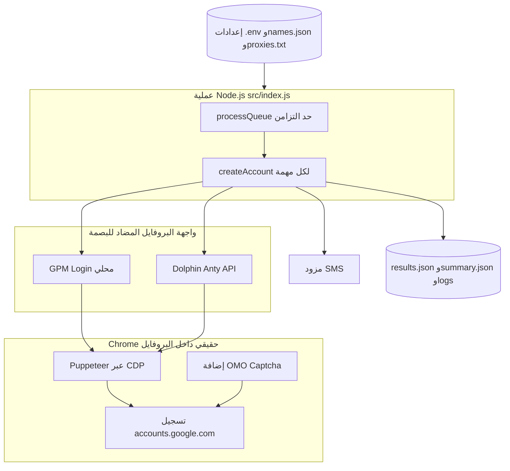
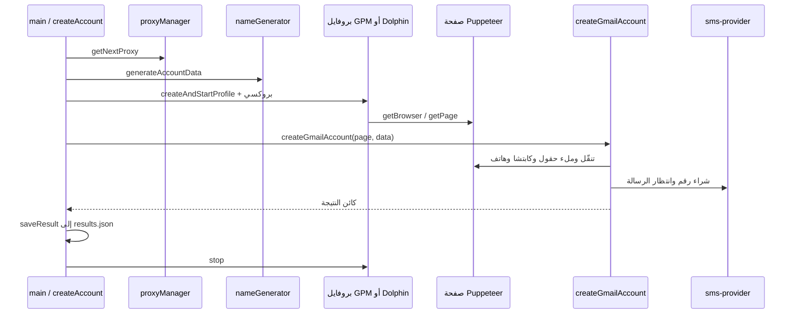
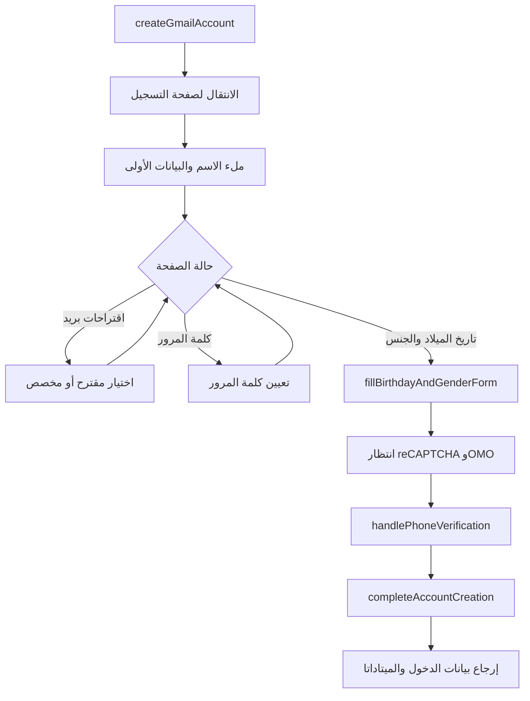

# منشئ حسابات Gmail — دليل عربي مفصّل

[](README.md)

هذا المستند يشرح **الخطوات والعمليات** بالتفصيل للمشروع [gmail-account-creator](https://github.com/code-root/gmail-account-creator)، ويتضمن **مخططات Mermaid**، **جداول للوحدات**، و**مرجعاً للدوال** (المصدَّرة والمساعدة داخل `creator.js`). النسخة الإنجليزية الافتراضية في [`README.md`](README.md) تحتوي على نفس المستوى من التفصيل.

---

## وصف المشروع

التطبيق يشغّل **متصفحاً حقيقياً** داخل **بروفايل مضاد للبصمة** (Antidetect) عبر:

- **GPM Login** (الافتراضي)، أو  
- **Dolphin Anty**

ثم يستخدم **Puppeteer** للاتصال بنفس المتصفح وملء نماذج إنشاء حساب Google، مع:

- **إضافة OMO Captcha** لمعالجة اختبارات مثل reCAPTCHA  
- **مزود SMS** لتأكيد رقم الهاتف (SMS Verification أو 5SIM Legacy حسب الإعدادات)

---

## العلامات والوصف المقترحة على GitHub

| الحقل | مقترح |
|--------|--------|
| **Description** | أتمتة تسجيل Gmail عبر GPM Login أو Dolphin Anty مع Puppeteer وOMO Captcha وواجهات SMS. |
| **Topics** | `gmail`, `automation`, `puppeteer`, `nodejs`, `gpm-login`, `dolphin-anty`, `captcha`, `sms-verification` |

---

## المتطلبات قبل البدء

1. **Node.js 18 أو أحدث** (مستحسن).  
2. **GPM Login** يعمل محلياً وواجهة الـ API متاحة (العنوان الافتراضي في المشروع `http://127.0.0.1:14517`) **أو** **Dolphin Anty** مع مفتاح API وعنوان الخادم.  
3. **مفتاح OMO Captcha** وإعداد الإضافة داخل قوالب البروفايل.  
4. **مفتاح مزود SMS** حسب [`ENV_VARIABLES.md`](ENV_VARIABLES.md).  
5. ملف **بروكسيات** `config/proxies.txt` بصيغة صحيحة.  
6. ملف **أسماء** `config/names.json` (يُستخدم لتوليد بيانات الحساب).

---

## التثبيت — خطوة بخطوة

### 1) استنساخ المشروع وتثبيت الحزم

```bash
git clone https://github.com/code-root/gmail-account-creator.git
cd gmail-account-creator
npm install
```

**ماذا يحدث؟** يتم تنزيل الاعتماديات من `package.json`، أهمها: `puppeteer-core`, `axios`, `dotenv`, `gologin`.

### 2) إنشاء ملف البيئة `.env`

```bash
cp .env.example .env
```

افتح `.env` واملأ القيم الحقيقية (لا ترفع الملف إلى Git — عادةً مُدرج في `.gitignore`).

**أهم المتغيرات:**

| المتغير | الوظيفة |
|---------|---------|
| `PROFILE_SERVICE` | `gpm` (افتراضي) أو `dolphin` لاختيار منصة البروفايلات |
| `GPM_API_URL` | عنوان API لـ GPM Login محلياً |
| `DOLPHIN_API_KEY`, `DOLPHIN_API_URL`, `DOLPHIN_FOLDER_ID` | إعدادات Dolphin عند اختيار `dolphin` |
| `OMOCAPTCHA_KEY` | مفتاح خدمة OMO Captcha |
| `SMS_VERIFY_API_KEY` | مفتاح SMS Verification (عند استخدام المزود الافتراضي) |
| `SMS_PROVIDER` | `sms-verification` أو `fivesim-legacy` — التفاصيل في [`ENV_VARIABLES.md`](ENV_VARIABLES.md) |
| `ACCOUNTS_COUNT` | عدد الحسابات المطلوب إنشاؤها في التشغيلة |
| `THREADS_COUNT` | عدد المهام المتزامنة (الخيوط) |

**ملاحظة:** الكود يحمّل `.env` أولاً، ويمكنه تجربة ملف `.emv` في حالات معيّنة إذا لم تُضبط متغيرات معيّنة — راجع `src/config.js`.

### 3) إعداد البروكسيات

الملف: `config/proxies.txt`

- سطر لكل بروكسي.  
- الصيغة: `ip:port` أو `ip:port:username:password`  
- الأسطر التي تبدأ بـ `#` تُعتبر تعليقاً.

إن لم يوجد الملف، قد يُنشئ النظام ملفاً فارغاً أو يتحذّر — يجب توفير بروكسيات كافية خاصةً عند زيادة `THREADS_COUNT`.

### 4) إعداد الأسماء

الملف: `config/names.json` — يُستخدم لتوليد أسماء ومقترحات بريد منطقية ضمن `src/utils/name-generator.js`.

### 5) إضافة OMO Captcha إلى البروفايل

يجب أن تكون **إضافة OMO Captcha** مثبّتة/مهيأة في بروفايلات GPM أو Dolphin التي يستخدمها السكربت.

- **معرّف الإضافة (Extension ID):** `dfjghhjachoacpgpkmbpdlpppeagojhe`  
- الإعداد البرمجي للإضافة يمر عبر `src/captcha/omo-handler.js` ويمكن تعطيل جزء الإعداد عبر `SETUP_OMO_CAPTCHA=false` عند الحاجة.

---

## التشغيل — أوامر وشرح السلوك

### تشغيل افتراضي (حساب واحد، خيط واحد)

```bash
npm start
```

### تشغيل دفعات مع تزامن

```bash
npm start -- --accounts=10 --threads=3
npm start -- -a=10 -t=3
```

أو:

```bash
ACCOUNTS_COUNT=10 THREADS_COUNT=3 npm start
```

**شرح المعاملات:**

- `--accounts` / `ACCOUNTS_COUNT`: كم **محاولة إنشاء** سيتم جدولتها.  
- `--threads` / `THREADS_COUNT`: كم **عملية متزامنة** تعمل في نفس الوقت. إذا كان عدد الخيوط أكبر من عدد الحسابات، يُعدّل البرنامج الخيوط لتطابق عدد الحسابات (راجع `src/index.js`).

### وضع التطوير (إعادة تشغيل عند التغيير)

```bash
npm run dev
```

يستخدم `node --watch` لملف الدخول.

### سكربت مجلدات Dolphin

```bash
npm run list-folders
```

مفيد عند ضبط `DOLPHIN_FOLDER_ID`.

---

## ماذا يحدث داخل البرنامج؟ (تسلسل العمليات)

يُنفَّذ المنطق الرئيسي في `src/index.js` بالترتيب التالي **لكل محاولة حساب**:

1. **اختيار بروكسي** من `proxy-manager` حسب الدور أو السياسة المعرفة في الكود.  
2. **توليد بيانات الحساب** (اسم، اسم مستخدم، إلخ) عبر `name-generator`.  
3. **إنشاء بروفايل** باسم يتضمن بادئة `Gmail_` والوقت، ثم **تشغيله** عبر GPM أو Dolphin.  
4. **ربط Puppeteer** بعنوان التصحيح البعيد (remote debugging) للمتصفح داخل البروفايل.  
5. **تشغيل مسار التسجيل** في `createGmailAccount` داخل `src/gmail/creator.js`: فتح صفحات Google، ملء الحقول، سلوك بشري محاكى، كشف الصفحات (`page-detector.js`).  
6. **طلب رقم SMS واستلام الرمز** عبر طبقة `src/providers/sms-provider.js` حسب `SMS_PROVIDER`.  
7. **عند النجاح:** حفظ سجل في `results.json` يتضمن البريد وكلمة المرور وتفاصيل البروفايل والبروكسي وعنوان IP الظاهر للبروفايل إن وُجد.  
8. **عند الفشل:** تسجيل الخطأ في `results.json` أيضاً.  
9. **في جميع الأحوال:** إيقاف البروفايل في كتلة `finally` لتفريغ الموارد.

بعد انتهاء كل المهام، يُكتب **ملخص التشغيلة** في `summary.json` (إحصائيات نجاح/فشل، المدة، إعدادات مختصرة).

---

## مخططات توضيحية

يعرض GitHub مخططات [Mermaid](https://mermaid.js.org/) تلقائياً داخل ملفات Markdown. إن لم تظهر لديك محلياً، افتح المستودع على GitHub أو استخدم إضافة معاينة تدعم Mermaid.

### السياق العام للنظام



### تسلسل زمني — حساب واحد (المسار الناجح المبسّط)



### مسار التسجيل داخل Gmail (منطقي)



### جدول — نموذج التزامن

| المفهوم | الشرح في هذا المشروع |
|--------|----------------------|
| **مهمة حساب** | استدعاء واحد لـ `createAccount()` = دورة حياة بروفايل واحد. |
| **Thread في السجلات** | بادعة تسجيل فقط؛ التنفيذ الفعلي عبر `async` وليس خيوط نظام تشغيل. |
| **التزامن** | `processQueue` يحدُّ أقصى عدد مهام متزامنة بـ `threadsCount`. |
| **حالة مشتركة** | كل مهمة لها بروفايلها؛ `proxyManager` يتتبع أسطر البروكسي المستخدمة. |

---

## جدول الوحدات البرمجية (ملف ← مسؤولية)

| المسار | المسؤولية |
|--------|-----------|
| `src/index.js` | معاملات سطر الأوامر، طابور المهام، `saveResult`، ملخص `summary.json`. |
| `src/config.js` | تحميل `.env` / `.emv`، كائن `config`، تحذيرات التحقق. |
| `src/gmail/creator.js` | أتمتة واجهة التسجيل؛ التصدير الرئيسي `createGmailAccount`. |
| `src/gmail/page-detector.js` | كشف نوع شاشة Google؛ دوال انتظار العناصر. |
| `src/captcha/omo-handler.js` | التحقق من الإضافة، إدخال المفتاح، `setupOMOCaptchaExtension`. |
| `src/gpmlogin/client.js` | طلبات HTTP إلى GPM (إنشاء/تشغيل/إيقاف البروفايل، بصمة). |
| `src/gpmlogin/profile.js` | صنف `GPMLoginProfile` ومصنع `createAndStartProfile`. |
| `src/dolphin/client.js` | واجهة REST لـ Dolphin (بروفايلات، مجلدات، بروكسي). |
| `src/dolphin/profile.js` | صنف `DolphinProfile` ومصنع `createAndStartProfile`. |
| `src/gologin/client.js` | عميل GoLogin السحابي (اختياري، ملف كبير). |
| `src/gologin/profile.js` | صنف `GoLoginProfile` ومصنع `createAndStartProfile`. |
| `src/providers/sms-provider.js` | اختيار مزود SMS الموحّد (SMS Verification أو 5SIM Legacy). |
| `src/providers/sms-verification-api.js` | دوال HTTP لمزود SMS Verification. |
| `src/providers/fivesim-api-legacy.js` | تكامل 5SIM Legacy (`api1.5sim.net`). |
| `src/utils/logger.js` | مستويات السجل، ملف يومي تحت `logs/`. |
| `src/utils/proxy-manager.js` | قراءة `config/proxies.txt` وتنسيقات البروكسي. |
| `src/utils/name-generator.js` | توليد هوية من `config/names.json`. |
| `src/utils/human-behavior.js` | حركة فأرة، تمرير، كتابة بتأخير بشري. |

---

## مرجع الدوال (شرح مختصر لكل دالة مصدَّرة أو método عام)

> الدوال **الداخلية** داخل `creator.js` لا تُستورد من ملفات أخرى؛ مذكورة في جدول منفصل للتوضيح فقط.

### `src/index.js`

| الدالة / الرمز | النوع | الوظيفة |
|----------------|-------|---------|
| `saveResult` | دالة | إلحاق سجل واحد في `results.json` مع وقت ISO. |
| `createAccount` | async | المسار الكامل: بروكسي → بيانات → بروفايل → `createGmailAccount` → حفظ → تنظيف. |
| `processQueue` | async | تشغيل مصفوفة من دوال async بدون معاملات مع حد أقصى للتزامن؛ إرجاع إحصائيات. |
| `main` | async | تحليل argv/env، بناء الطابور، استدعاء `processQueue`، كتابة `summary.json`. |
| التصدير الافتراضي | كائن | `{ createAccount, main }` للاستخدام البرمجي. |

### `src/config.js`

| الرمز | الوظيفة |
|-------|---------|
| `config` | كائن يضم `profileService`, `gpmlogin`, `dolphin`, `gologin`, `omocaptcha`, `smsVerify`, `app`. |
| `default` | نفس `config`. |

### `src/gmail/creator.js`

| الدالة | الوظيفة |
|--------|---------|
| `createGmailAccount(page, accountData)` | **التصدير الرئيسي.** يقود كامل حوار إنشاء الحساب على صفحة Puppeteer. |

**دوال مساعدة داخلية (ترتيب منطقي تقريبي):**

| الدالة | الدور |
|--------|--------|
| `getCountrySelection` | اختيار دولة الرسائل حسب المزود والإعدادات. |
| `humanLikeType` | كتابة شبيهة بالإنسان في حقل إدخال. |
| `ensurePageOpen` | التأكد أن الصفحة جاهزة قبل العمليات. |
| `navigateToSignUp` | فتح مسار التسجيل. |
| `fillSignUpForm` | حقول الاسم والبداية. |
| `selectRandomSuggestedEmail` | اختيار من اقتراحات Gmail. |
| `clickCreateOwnGmailAddress` | مسار «إنشاء عنوان Gmail خاص بك». |
| `fillUsernameAndPassword` | اسم المستخدم وكلمة المرور والخطوات المرتبطة. |
| `fillBirthdayAndGenderForm` | تاريخ الميلاد والجنس. |
| `waitForRecaptcha` | انتظار/التعامل مع reCAPTCHA مع OMO. |
| `handlePhoneVerification` | شراء رقم، إدخاله، استلام الرمز عبر المزود. |
| `generateRecoveryEmail` | توليد بريد استرداد عند الحاجة. |
| `completeAccountCreation` | خطوات الإنهاء والمراجعة. |
| `clickNextButton` | الضغط على «التالي» مع بدائل للمحSelectors. |

### `src/gmail/page-detector.js`

| الدالة | الوظيفة |
|--------|---------|
| `detectGmailPage` | تقدير نوع شاشة التسجيل الحالية. |
| `waitForElement` | انتظار ظهور محدد CSS. |
| `elementExists` | فحص وجود عنصر. |
| `waitForPageLoad` | انتظار اكتمال التحميل. |
| *(داخلية)* `detectSignInPage`, `detectSignUpPage`, `detectVerificationPage`, `detectByClassNames`, `detectByElements` | مساعدات لـ `detectGmailPage`. |

### `src/captcha/omo-handler.js`

| الدالة | الوظيفة |
|--------|---------|
| `checkRecaptchaExtension` | التحقق من وجود إضافة الكابتشا. |
| `openOMOCaptchaExtension` | فتح واجهة الإضافة. |
| `setOMOCaptchaKeyViaAPI` | تعيين مفتاح OMO عبر API الإضافة إن أمكن. |
| `enterOMOCaptchaKey` | إدخال المفتاح عبر واجهة الإضافة. |
| `clickRecaptchaRefreshButton` | تحديث عنصر الكابتشا. |
| `setupOMOCaptchaExtension` | تسلسل إعداد OMO قبل الحاجة للكابتشا. |

### `src/gpmlogin/client.js`

| الدالة | الوظيفة |
|--------|---------|
| `generateAndroidUserAgent` | توليد User-Agent أندرويد. |
| `generateAndroidFingerprint` | بصمة جهاز للبروفايل. |
| `checkGPMConnection` | فحص الاتصال بـ GPM. |
| `createProfile` | إنشاء بروفايل مع بروكسي اختياري. |
| `startProfile` | تشغيل البروفايل وإرجاع عنوان التصحيح. |
| `stopProfile` | إيقاف مع إعادة محاولات. |
| `deleteProfile` | حذف البروفايل. |
| `getProfile` | جلب بيانات البروفايل. |

### صنف `GPMLoginProfile` في `src/gpmlogin/profile.js`

| الطريقة | الوظيفة |
|---------|---------|
| `start` | تشغيل البروفايل وحل نقطة WebSocket/CDP. |
| `getBrowser` | الاتصال عبر `puppeteer.connect`. |
| `getPage` | الحصول على تبويب/صفحة للعمل. |
| `stop` / `delete` | إيقاف أو حذف البروفايل. |
| `injectAntiDetectionScripts` | حقن سكربتات تخفيف كشف الأتمتة. |
| `createAndStartProfile` *(مصدَّرة)* | إنشاء ثم تشغيل وإرجاع كائن الجلسة. |

### `src/dolphin/client.js` (دوال مصدَّرة)

| الدالة | الوظيفة |
|--------|---------|
| `checkDolphinConnection` | التحقق من المفتاح والوصول. |
| `createProfile` / `startProfile` / `stopProfile` / `deleteProfile` / `getProfile` | دورة حياة البروفايل. |
| `updateProfileProxy` | تطبيق بروكسي على بروفايلات. |
| `getFolderList`, `getAllFolders`, `findFolderByName`, `createFolder`, `getFirstAvailableFolder`, `getOrCreateFolder` | إدارة المجلدات. |

### صنف `DolphinProfile` في `src/dolphin/profile.js`

| الطريقة | الوظيفة |
|---------|---------|
| `start`, `getBrowser`, `getPage`, `stop`, `delete` | مثل GPM من ناحية الدور. |
| `createAndStartProfile` *(مصدَّرة)* | مصنع جاهز لـ Dolphin. |

### صنف `GoLoginProfile` في `src/gologin/profile.js`

| الطريقة | الوظيفة |
|---------|---------|
| `start`, `getBrowser`, `getPage`, `stop`, `delete` | دورة حياة GoLogin. |
| `createAndStartProfile` *(مصدَّرة)* | مصنع عند استخدام مسار GoLogin. |

### `src/gologin/client.js` — `GoLoginClient` (التصدير الافتراضي)

| الطريقة | الوظيفة |
|---------|---------|
| `request` | HTTP موثّق لـ API. |
| `getProfiles`, `getProfile`, `createProfile`, `updateProfile`, `updateProfileProxy` | إدارة البروفايلات. |
| `startProfile`, `stopProfile`, `deleteProfile` | تشغيل وإيقاف وحذف. |
| `testProxy`, `createProfileWithProxy` | اختبار بروكسي وإنشاء مدمج. |

### `src/providers/sms-verification-api.js`

| الدالة | الوظيفة |
|--------|---------|
| `getSmsVerifyBalance` | الرصيد. |
| `getSmsVerifyCountries`, `getSmsVerifyPrices`, `getSmsVerifyServices` | استعلامات الكتالوج/الأسعار. |
| `buySmsVerifyNumber`, `buySmsVerifyNumberV2` | شراء رقم لخدمة معيّنة. |
| `checkSmsVerifyOrder` | حالة الطلب. |
| `setSmsVerifyStatus` | تحديث حالة الطلب. |
| `cancelSmsVerifyOrder`, `finishSmsVerifyOrder`, `retrySmsVerifyOrder` | إدارة دورة الرقم. |
| `getSmsVerifyActivations` | قائمة التفعيلات. |
| `waitForSmsVerifyCode` | انتظار وصول الرمز. |
| `buyNumberAndGetSMS` | شراء + انتظار الرمز في استدعاء واحد معقّد. |

### `src/providers/sms-provider.js`

| الرمز | الوظيفة |
|-------|---------|
| `getBalance`, `buyNumber`, `buyNumberAndGetSMS` | واجهة موحّدة بعد تحميل المزود. |
| `getOrderStatus`, `waitForSMS` | متابعة الطلب والرسالة. |
| `cancelOrder`, `finishOrder`, `requestResend`, `setOrderStatus` | إدارة الطلب. |
| `reportNumberUsed` | خاص بـ 5SIM عند الحاجة. |
| `getServiceName`, `getProviderType` | للسجلات والتشخيص. |
| `SMS_PROVIDER_INFO` | `{ current: SMS_PROVIDER }`. |
| أسماء بديلة | `buySmsVerifyNumber`, `waitForSmsVerifyCode`, … تطابق الواجهة القديمة. |
| `SMS_VERIFY_COUNTRIES` | إعادة تصدير ثوابت الدول. |

### `src/utils/logger.js`

| الرمز | الوظيفة |
|-------|---------|
| `logger` / `default` | `error`, `warn`, `info`, `debug` — للكونسول وملف السجل اليومي. |
| *(داخلية)* `formatMessage`, `shouldLog`, `writeLog` | تنسيق وفلترة المستوى. |

### `ProxyManager` في `src/utils/proxy-manager.js`

| الطريقة | الوظيفة |
|---------|---------|
| `loadProxies` | قراءة الملف. |
| `getNextProxy` | اختيار عشوائي من غير المستخدم. |
| `markAsUsed`, `releaseProxy`, `reset` | تتبع التوفر. |
| `getGPMLoginFormat`, `getGoLoginFormat`, `getStringFormat` | تحويل للصيغ المطلوبة وللسجلات. |
| `getAvailableCount` | عدد تقريبي للبروكسيات المتاحة. |

### `NameGenerator` في `src/utils/name-generator.js`

| الطريقة | الوظيفة |
|---------|---------|
| `loadNames` | تحميل JSON. |
| `getRandomName` | اسم أول عشوائي. |
| `generateUsername` | جزء محلي مقترح للبريد. |
| `generatePassword` | كلمة مرور قوية. |
| `generateAccountData` | كائن حساب كامل جاهز للتسجيل. |

### `src/utils/human-behavior.js`

| الدالة | الوظيفة |
|--------|---------|
| `randomDelay`, `getHumanDelay` | زمن عشوائي مناسب لنوع الحركة. |
| `humanSleep` | تأخير غير ثابت. |
| `humanMouseMove`, `getElementCenter` | مسار فأرة منحنٍ نحو هدف. |
| `humanClick`, `humanClickAt` | نقرة مع حركة وتوقيت. |
| `humanScroll`, `humanScrollToElement` | تمرير تدريجي. |
| `explorePageRandomly` | تفاعلات عشوائية خفيفة بالصفحة. |
| `humanType` | كتابة حرف بحرف مع أخطاء اختيارية. |
| `idleMouseMovement`, `simulateReading`, `performRandomAction` | محاكاة خمول المستخدم. |
| `humanWait` | انتظار مع إجراءات عشوائية أحياناً. |
| `simulateTabSwitch` | محاكاة تبديل نافذة/تركيز. |
| *(داخلية)* `bezierPoint`, `cubicBezierPoint`, `generateMousePath` | حساب مسار الفأرة. |

---

## المخرجات والسجلات

| الملف / المجلد | المحتوى |
|----------------|---------|
| `results.json` | سجل لكل محاولة (نجاح أو فشل) مع الطابع الزمني |
| `summary.json` | ملخص آخر تشغيلة كاملة |
| `logs/` | سجلات تفصيلية حسب `LOG_LEVEL` |

---

## الإصدارات (Releases) وحزمة GitHub Packages

اسم الحزمة على سجل npm الخاص بـ GitHub: **`@code-root/gmail-account-creator`** (يجب أن يطابق نطاق الاسم مالك المستودع `code-root`).

### إنشاء إصدار على GitHub مع ملف `.tgz`

1. حدّث الحقل `version` في `package.json` وادفع التغييرات.  
2. أنشئ وسِم إصدار وادفعه: `git tag v1.0.1 && git push origin v1.0.1`  
3. سيعمل سير العمل **Release** (`.github/workflows/release.yml`): يبني `npm pack` ويرفق الأرشيف لصفحة [الإصدار](https://docs.github.com/en/repositories/releasing-projects-on-github/about-releases) مع ملاحظات تلقائية.

### التثبيت من GitHub Packages

أضف إلى `.npmrc` (مع [رمز وصول](https://docs.github.com/en/packages/working-with-a-github-packages-registry/working-with-the-npm-registry) يملك `read:packages`):

```text
@code-root:registry=https://npm.pkg.github.com
//npm.pkg.github.com/:_authToken=YOUR_GITHUB_TOKEN
```

ثم:

```bash
npm install @code-root/gmail-account-creator
```

تشغيل عبر `npx` أو الأمر العام بعد التثبيت الشامل:

```bash
npx @code-root/gmail-account-creator
gmail-account-creator
```

### النشر التلقائي

عند **نشر** إصدار GitHub (Release published)، سير العمل **Publish to GitHub Packages** (`.github/workflows/publish-github-packages.yml`) ينفّذ `npm publish` باستخدام `GITHUB_TOKEN`.

---

## سير عمل GitHub المقترح (حسب التقنية)

المشروع يستخدم **Node + ESM** بدون اختبارات Jest مدمجة في `package.json`. السيرات المضمّنة:

1. **CI:** `npm ci` + `node --check` — `.github/workflows/ci.yml`  
2. **Release:** عند دفع وسم `v*` — `.github/workflows/release.yml`  
3. **نشر الحزمة:** عند نشر إصدار — `.github/workflows/publish-github-packages.yml`  
4. **Dependabot (اختياري):** تحديثات أسبوعية لـ `npm`.  
5. **عدم رفع أسرار:** التأكد أن `.env` غير مرفوع.

---

## تحذير قانوني وأخلاقي

أتمتة إنشاء حسابات Google قد **تخالف شروط استخدام Google** والقوانين المحلية. استخدم المشروع فقط في بيئات تملكها، وبإذن صريح، ولأغراض مشروعة (مثل اختبار أنظمتك الداخلية). المسؤولية الكاملة عن الاستخدام تقع على المستخدم.

---

## مراجع سريعة داخل المستودع

- [`USAGE.md`](USAGE.md) — أمثلة أوامر إضافية  
- [`ENV_VARIABLES.md`](ENV_VARIABLES.md) — شرح متغيرات البيئة والمزودين  
- [`SETUP.md`](SETUP.md) — ملاحظات إعداد (استبدل أي مفاتيح وهمية/قديمة بمفاتيحك الخاصة)  
- [`GITHUB_SETUP.md`](GITHUB_SETUP.md) — إعداد GitHub إن وُجد  

الرابط العام للمشروع: [https://github.com/code-root/gmail-account-creator](https://github.com/code-root/gmail-account-creator)
